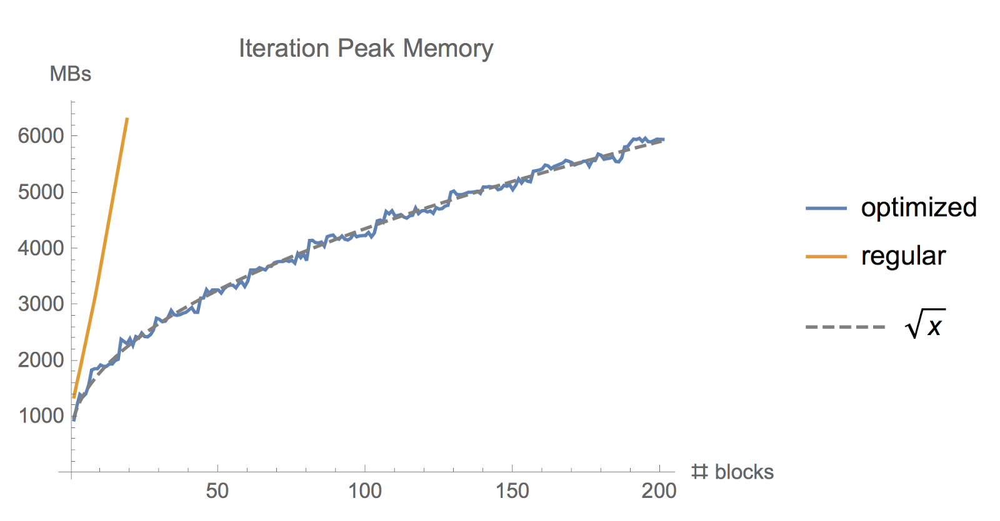
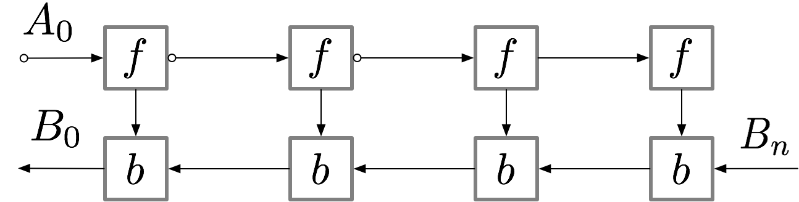
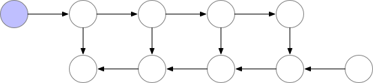
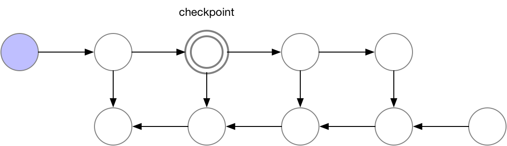
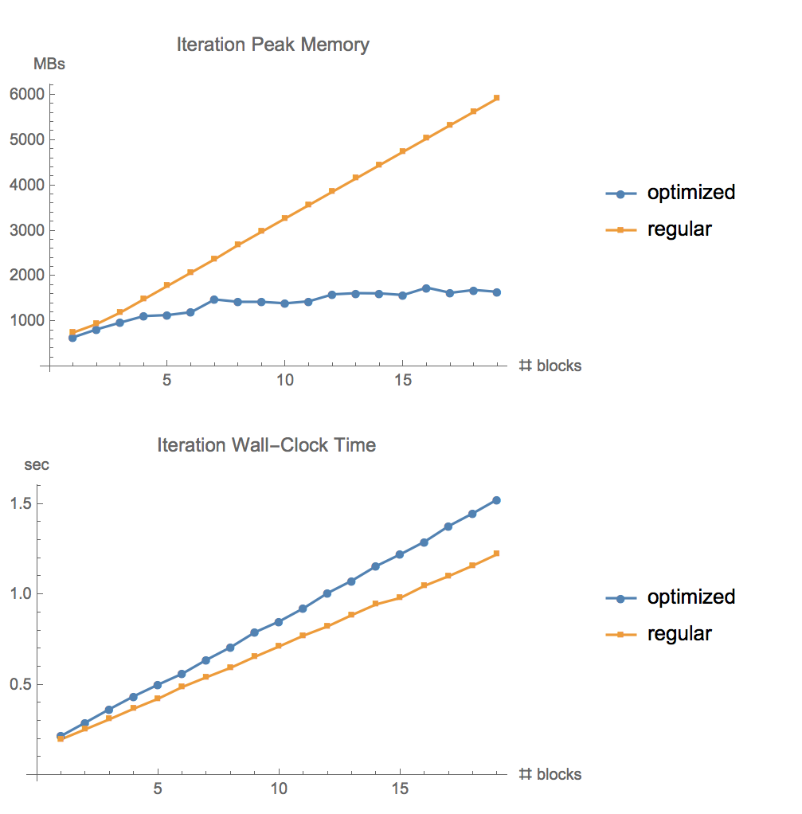

**Status:** Maintenance (expect bug fixes and minor updates)

# Saving memory using gradient-checkpointing

Training very deep neural networks requires a lot of memory. Using the tools in this package, developed jointly by Tim Salimans and Yaroslav Bulatov, you can trade off some of this memory usage with computation to make your model fit into memory more easily. For feed-forward models we were able to fit more than 10x larger models onto our GPU, at only a 20% increase in computation time.

The memory intensive part of training deep neural networks is computing the gradient of the loss by backpropagation. By checkpointing nodes in the computation graph defined by your model, and recomputing the parts of the graph in between those nodes during backpropagation, it is possible to calculate this gradient at reduced memory cost. When training deep feed-forward neural networks consisting of *n* layers, we can reduce the memory consumption to *O(sqrt(n))* in this way, at the cost of performing one additional forward pass (see e.g. [Training Deep Nets with Sublinear Memory Cost, by Chen et al. (2016)](https://arxiv.org/pdf/1604.06174.pdf)). This repository provides an implementation of this functionality in Tensorflow, using the [Tensorflow graph editor](https://www.tensorflow.org/versions/r1.0/api_guides/python/contrib.graph_editor) to automatically rewrite the computation graph of the backward pass.


*Memory used while training a [ResNet model](https://github.com/tensorflow/models/blob/master/official/resnet/cifar10_main.py) with large batch size, using the regular tf.gradients function and using our memory-optimized gradient implementation*

## How it works
For a simple feed-forward neural network with *n* layers, the computation graph for obtaining gradients looks as follows:



The activations of the neural network layers correspond to the nodes marked with an *f*. During the forward pass all these nodes are evaluated in order. The gradient of the loss with respect to the activations and parameters of these layers is indicated by the nodes marked with *b*. During the backward pass, all these nodes are evaluated in the reversed order. The results obtained for the *f* nodes are needed to compute the *b* nodes, and hence all *f* nodes are kept in memory after the forward pass. Only when backpropagation has progressed far enough to have computed all dependencies, or *children*, of an *f* node, can it be erased from memory. This means that the memory required by simple backprop grows linearly with the number of neural net layers *n*. Below we show the order in which these nodes are computed. The purple shaded circles indicate which of the nodes need to be held in memory at any given time.



Graph 1. *Vanilla backprop*

Simple backpropagation as described above is optimal in terms of computation: it only computes each node once. However, if we are willing to recompute nodes we can potentially save a lot of memory. We might for instance simply recompute every node from the forward pass each time we need it. The order of execution, and the memory used, then look as follows:


Graph 2. *Memory poor backprop*

Using this strategy, the memory required to compute gradients in our graph is constant in the number of neural network layers *n*, which is optimal in terms of memory. However, note that the number of node evaluations now scales with *n^2*, whereas it previously scaled as *n*: Each of the *n* nodes is recomputed on the order of *n* times. The computation graph thus becomes much slower to evaluate for deep networks, which makes this method impractical for use in deep learning.

To strike a balance between memory and computation we need to come up with a strategy that allows nodes to be recomputed, but not too often. The strategy we use here is to mark a subset of the neural net activations as *checkpoint nodes*. 



*Our chosen checkpoint node*

These checkpoint nodes are kept in memory after the forward pass, while the remaining nodes are recomputed at most once. After being recomputed, the non-checkpoint nodes are kept in memory until they are no longer required. For the case of a simple feed-forward neural net, all neuron activation nodes are graph separators or *articulation points* of the graph defined by the forward pass. This means that we only need to recompute the nodes between a *b* node and the last checkpoint preceding it when computing that *b* node during backprop. When backprop has progressed far enough to reach the checkpoint node, all nodes that were recomputed from it can be erased from memory. The resulting order of computation and memory usage then look as follows


Graph 3. *Checkpointed backprop*

For the simple feed-forward network in our example, the optimal choice is to mark every *sqrt(n)*-th node as a checkpoint. This way, both the number of checkpoint nodes and the number of nodes inbetween checkpoints are on the order of *sqrt(n)*, which means that the required memory now also scales with the square root of the number of layers in our network. Since every node is recomputed at most once, the additional computation required by this strategy is equivalent to a single forward pass through the network.

Our package implements *checkpointed backprop* as shown in Graph 3 above. This is implemented by taking the graph for standard backprop (Graph 1 above) and automatically rewriting it using the Tensorflow graph editor. For graphs that contain articulation points (single node graph dividers) we automatically select checkpoints using the *sqrt(n)* strategy, giving *sqrt(n)* memory usage for feed-forward networks. For more general graphs that only contain multi-node graph separators our implementation of checkpointed backprop still works, but we currently require the user to manually select the checkpoints.

Additional explanation of computation graphs, memory usage, and gradient computation strategies, can be found in the [blog post](https://medium.com/@yaroslavvb/fitting-larger-networks-into-memory-583e3c758ff9) accompanying our package.

## Setup requirements
```
pip install tf-nightly-gpu
pip install toposort networkx pytest
```
Also, when running the tests, make sure that the CUDA Profiling Tools Interface (CUPTI) can be found, e.g. by running `export LD_LIBRARY_PATH="${LD_LIBRARY_PATH}:/usr/local/cuda/extras/CUPTI/lib64"`

## Usage
This repository provides a drop-in replacement for [tf.gradients](https://www.tensorflow.org/api_docs/python/tf/gradients) in base Tensorflow. Import this function using

```
from memory_saving_gradients import gradients
```
and use the `gradients` function like you would normally use `tf.gradients` to compute gradients of losses to parameters. (This assumes you are explicitly calling `tf.gradients`, rather than implicitly inside a `tf.train.Optimizer`).

In addition to the regular arguments to tf.gradients, our gradients function has one additional argument, *checkpoints*. The *checkpoints* argument tells the gradients function which nodes of the graph you want to checkpoint during the forward pass through your computation graph. The nodes in between the checkpoints are then recomputed during the backward pass. You can supply a list of tensors to checkpoint, `gradients(ys,xs,checkpoints=[tensor1,tensor2])`, or you can use one of several keywords:

- 'collection' (default): This checkpoints all tensors returned by `tf.get_collection('checkpoints')`. You then need to make sure you add tensors to this collection using `tf.add_to_collection('checkpoints', tensor)` when you define your model.
- 'memory' : This uses a heuristic to automatically select a set of nodes to checkpoint which achieves our desired *O(sqrt(n))* memory usage. The heuristic works by automatically identifying *articulation points* in the graph, i.e. tensors which split the graph into two disconnected parts when removed, and then checkpointing a suitable number of these tensors. This currently works well for many, but not all, models.
- 'speed' : This option tries to maximize running speed by checkpointing the outputs of all ops that are typically expensive to compute, namely convolutions and matrix multiplies.

### Overwriting tf.gradients
A useful alternative to using the new `gradients` function directly is to just overwrite the function that python has registered to the `tf.gradients` name. This can be done as follows:

```
import tensorflow as tf
import memory_saving_gradients
# monkey patch tf.gradients to point to our custom version, with automatic checkpoint selection
tf.__dict__["gradients"] = memory_saving_gradients.gradients_speed
```
Following this, all calls to `tf.gradients` will use the memory saving version instead.

The same can be done when using Keras:
```
import memory_saving_gradients as gc
from tensorflow.python.ops import gradients as tf_gradients
tf_gradients.gradients = gc.gradients_speed
```

Replace `gradients_speed` with `gradients_memory` or `gradients_collection` to use the other methods of checkpoint selection.

## Tests
The test folder contains scripts for testing the correctness of the code and to profile the memory usage for various models. After modifying the code you can run `./run_all_tests.sh` from this folder to execute the tests.



*Testing memory usage and running time for ResNet on CIFAR10 for different numbers of layers. Batch-size 1280, GTX1080*

## Limitations
The provided code does all graph manipulation in python before running your model which is slow for large graphs. The current algorithm for automatically selecting checkpoints is purely heuristic and is expected to fail on some models outside of the class we have tested. In such cases manual mode checkpoint selection should be used: Add your chosen checkpoint nodes to a Tensorflow collection names "checkpoints" and use `checkpoints=collection` when calling our gradients function.

## References

- Academic works describing checkpointed backpropagation:
[Training Deep Nets with Sublinear Memory Cost, by Chen et al. (2016)](https://arxiv.org/pdf/1604.06174.pdf), [Memory-Efficient Backpropagation Through Time, by Gruslys et al. (2016)](https://arxiv.org/abs/1606.03401v1), [Exact Alpha-Beta Computation in
Logarithmic Space with Application to MAP Word Graph Construction, by Zweig et al. (2000)](https://www.microsoft.com/en-us/research/publication/exact-alpha-beta-computation-in-logarithmic-space-with-application-to-map-word-graph-construction/), [Debugging Backwards in Time, by Bil Lewis (2003)](https://arxiv.org/abs/cs/0310016), [Evaluating Derivatives: Principles and Techniques of Algorithmic Differentiation, by Griewank and Walther (2008)](https://epubs.siam.org/doi/book/10.1137/1.9780898717761)


- Explanation of using graph_editor to implement checkpointing on TensorFlow graphs:
<https://github.com/tensorflow/tensorflow/issues/4359#issuecomment-269241038>, [https://github.com/yaroslavvb/stuff/blob/master/simple_rewiring.ipynb](https://github.com/yaroslavvb/stuff/blob/master/simple_rewiring.ipynb)

- Experiment code/details: <https://medium.com/@yaroslavvb/testing-memory-saving-on-v100-8aa716bbdf00>

- TensorFlow memory tracking package:
<https://github.com/yaroslavvb/chain_constant_memory/blob/master/mem_util_test.py>

- Implementation of "memory-poor" backprop strategy in TensorFlow for a simple feed-forward net:
<https://github.com/yaroslavvb/chain_constant_memory/>
